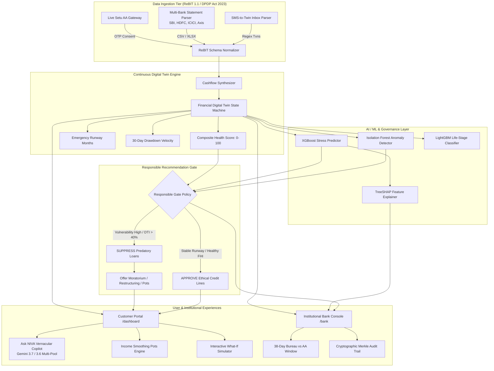

# NIVA — Responsible Financial Intelligence for Bharat 🇮🇳

<p align="center">
  
  
  
  
  
  
  
</p>

<p align="center">
  <strong>An autonomous, hyper-personalized financial intelligence ecosystem bridging the 38-day credit blind spot for 400M+ Indians in Bharat.</strong><br>
  <em>Engineered with RBI Account Aggregator (AA) telemetry, deterministic Financial Digital Twins, XAI SHAP underwriting, Bharat Income Smoothing Pots, and empathetic credit governance.</em>
</p>

---

## 📌 Table of Contents
1. [Executive Summary & Macro Thesis](#-executive-summary--macro-thesis)
2. [The 38-Day Information Blind Window](#-the-38-day-information-blind-window)
3. [Key Technical Innovations](#-key-technical-innovations)
4. [Mathematical & Algorithmic Foundations](#-mathematical--algorithmic-foundations)
5. [End-to-End System Architecture](#-end-to-end-system-architecture)
6. [Machine Learning & XAI Governance Pipeline](#-machine-learning--xai-governance-pipeline)
7. [Visual Showcase & Interactive Demos](#-visual-showcase--interactive-demos)
8. [Dual Portal Experience](#-dual-portal-experience)
9. [Data Ingestion Pipelines & Universal Normalizer](#-data-ingestion-pipelines--universal-normalizer)
10. [Judge's Evaluation Matrix & Live Personas](#-judges-evaluation-matrix--live-personas)
11. [API Architecture & Endpoints](#-api-architecture--endpoints)
12. [Repository Structure](#-repository-structure)
13. [Step-by-Step Setup & Quickstart](#-step-by-step-setup--quickstart)
14. [Regulatory & Statutory Compliance](#-regulatory--statutory-compliance)
15. [Team & Engineering Credits](#-team--engineering-credits)

---

## 🌟 Executive Summary & Macro Thesis

India possesses the world's most sophisticated digital payments infrastructure (UPI processing **14B+ monthly transactions**), yet retail lending remains fundamentally archaic:
* **The Static Score Paradox**: 92% of retail credit underwriting in India is anchored to static credit bureau reports (CIBIL, Experian, CRIF) that update once every **30 to 45 days**.
* **The 400M Bharat Gap**: Over 400 million gig workers (Swiggy, Zomato, Uber), Kirana merchants, and informal earners suffer from **income volatility**, not lack of creditworthiness. Because their cashflows ebb and flow across seasonal cycles, legacy bureau algorithms misclassify them as high-risk subprime borrowers.
* **Predatory Cross-Selling**: Traditional mobile banking applications detect vulnerability too late. When borrowers encounter sudden health emergencies, lenders algorithmically push unsecured, high-interest personal loans (18–36% APR), escalating transient cashflow stress into formal **Non-Performing Assets (NPAs)**.

**NIVA** (*Nuanced Intelligence Virtual Advisor*) replaces lagging bureau scores with a **continuous, deterministic Financial Digital Twin (FDT)** powered by real-time **RBI Account Aggregator (AA)** telemetry. 

```
                          LEGACY LENDING (THE OLD WAY)
  [Live Cashflow Shock] ──► [38-Day Reporting Lag] ──► [Predatory Push Loan] ──► [Default / NPA]

                               NIVA ARCHITECTURE
  [Live AA Telemetry] ──► [Digital Twin Update] ──► [Responsible Gate] ──► [Proactive Moratorium / Pots]
```

---

## ⚡ The 38-Day Information Blind Window

Traditional credit bureaus reflect borrower state with an inherent reporting latency:
$$\tau_{\text{bureau}} \in [30, 45] \text{ days}$$

During this blind interval, borrowers undergo rapid financial trajectory shifts:
1. **Hidden Delinquency ($3.4\times$)**: While Bureau reports show a healthy **760 score**, real-time AA telemetry reveals an active **-38% drawdown velocity** in liquid bank balances over trailing 21-day windows.
2. **Double Leveraging Risk**: Stressed borrowers accumulate multiple simultaneous credit lines across digital lenders before the first default surfaces on bureau records.
3. **Information Asymmetry Reversal**: NIVA gives both the customer and the underwriting bank simultaneous, transparent visibility into real-time cashflow runway, converting a 38-day lag into a **sub-second telemetry stream**.

| Dimension | Traditional Bureau Model | NIVA Real-Time AA Model |
| :--- | :--- | :--- |
| **Data Cadence** | Batch monthly update (30–45 day lag) | Streaming live telemetry via ReBIT 1.1 schema |
| **Coverage** | Historical debt repayment only | Granular daily cashflows, merchant entropy, liquid runway |
| **Income Assessment** | Fixed monthly salary assumption | Volatility-aware dynamic income smoothing |
| **Underwriting Stance** | Aggressive loan push up to credit limit | **Responsible Recommendation Gate** (ethical loan suppression) |
| **Explainability** | Black-box numerical score | **SHAP TreeExplainer** with RBI-compliant feature attributions |

---

## 💡 Key Technical Innovations

### 1. Continuous Financial Digital Twin (FDT)
* Synthesizes multi-bank accounts, recurring bills, UPI mandates, and liquid balances into a live mathematical state machine.
* Computes deterministic metrics: **Composite Health Index ($FHI$)**, **Debt-to-Income ($DTI$)**, **Liquid Buffer Runway ($M_{\text{runway}}$)**, and **Savings Rate Velocity**.

### 2. The Responsible Recommendation Gate (RRG)
* An unbypassable ethical underwriting firewall built between customer vulnerability and product cross-selling.
* **Algorithmic Suppression**: Evaluates four sequential gates: *Hard Eligibility*, *Suitability Scoring*, *Vulnerability Index ($VI$)*, and *Stress Shock Absorption*.
* If a customer's liquid runway drops below 1.5 months or $DTI > 40\%$, personal loans and revolving credit cards are **automatically suppressed** and replaced with **proactive relief**:
  * Emergency EMI moratoriums
  * Restructuring into subsidized low-interest credit (e.g. PM SVANidhi 7% lines)
  * Automated liquidity shields

### 3. Bharat Income Smoothing Engine & Personalized Pots
* **The Income Volatility Defense**: For gig workers and Kirana owners with seasonal income swings.
* **Dynamic Sweep Architecture**:
  * **Surplus Months**: Automatically sweeps 10–15% of surplus into liquid, risk-free emergency pots.
  * **Shock Months**: Auto-releases liquidity to cover non-negotiable household essentials (Rent, BESCOM electricity, school fees) without forcing the family into high-interest payday loans.
* **Personalized Bharat Envelopes**: Pre-configured and customizable pots (Dukaan Stock, School Fees, Two-Wheeler EMI, Medical Reserve, Festival).

### 4. Zero-Hallucination Vernacular Voice Copilot
* Multilingual conversational companion fluent in **English, हिन्दी (Hindi), and ગુજરાતી (Gujarati)**.
* **Strict Arithmetic Separation**: Large Language Models never compute financial arithmetic. All affordability checks, buffer calculations, and What-If projections are computed by deterministic Python services; the LLM merely structures the response into empathetic, authentic regional phrasing.
* **Resilient Multi-Model Gemini Fallback Pool**: Automatically cascades through `gemini-3.7-flash`, `gemini-3.6-flash`, `gemini-3.5-flash`, and `gemini-flash-latest` to guarantee zero downtime during API rate limits.

### 5. Universal Ingestion: Live Setu AA Gateway + Multi-Bank Parser
* **Live Setu Account Aggregator**: Implements the official ReBIT 1.1 / 2.1 protocol with purpose-bound digital consent management and OTP verification.
* **Universal Bank Statement Parser**: Robust column mapping and narration classification supporting **SBI, HDFC, ICICI, Bank of Baroda, Axis, and PNB**.
* **SMS-to-Twin Parser**: Instant statement sync from raw transactional SMS text without downloading bank PDFs.

---

## 📐 Mathematical & Algorithmic Foundations

### 1. Composite Financial Health Index ($FHI$)
The overall financial health score $FHI \in [0, 100]$ is computed as a weighted harmonic-linear composite of four orthogonal vectors:
$$FHI = w_1 \cdot \mathcal{S}_{\text{liquidity}} + w_2 \cdot \mathcal{S}_{\text{savings}} + w_3 \cdot \mathcal{S}_{\text{debt}} + w_4 \cdot \mathcal{S}_{\text{entropy}}$$

Where:
$$\mathcal{S}_{\text{liquidity}} = \min\left(100, \frac{M_{\text{runway}}}{M_{\text{target}}} \times 100\right), \quad M_{\text{runway}} = \frac{B_{\text{available}}}{E_{\text{monthly, essential}}}$$
$$\mathcal{S}_{\text{savings}} = \max\left(0, \min\left(100, \frac{I_{\text{net}} - E_{\text{total}}}{I_{\text{net}}} \times 200\right)\right)$$
$$\mathcal{S}_{\text{debt}} = \max\left(0, 100 - \left(\frac{\sum \text{EMI}}{I_{\text{net}}} \times 200\right)\right)$$

### 2. Shannon Entropy of Spending ($\mathcal{H}_{\text{spend}}$)
Measures diversification across spending categories to detect lifestyle shocks and undisciplined outlays:
$$\mathcal{H}_{\text{spend}} = -\sum_{i=1}^{K} p_i \log_2(p_i), \quad p_i = \frac{\text{Expense}_i}{\sum_{j=1}^K \text{Expense}_j}$$
* Normal healthy baseline: $\mathcal{H}_{\text{spend}} \in [2.4, 3.2]$ bits across $\ge 6$ standard ReBIT categories.
* Concentration spike ($\mathcal{H}_{\text{spend}} < 1.2$ bits) indicates emergency capital drain (e.g. ICU hospital bills).

### 3. Isolation Forest Anomaly Formulation
For detecting circular transfers, salary disruption, and round-tripping:
$$s(x, n) = 2^{-\frac{\mathbb{E}(h(x))}{c(n)}}$$
Where $h(x)$ is path length in the ensemble of $t=150$ randomized isolation trees, and $c(n)$ is the average path length of unsuccessful searches in a Binary Search Tree:
$$c(n) = 2\left(\ln(n - 1) + 0.5772156649\right) - \frac{2(n - 1)}{n}$$

### 4. SHAP (SHapley Additive exPlanations) Attribution
For RBI Model Risk Management compliance, every risk score is decomposed into additive feature contributions:
$$\phi_i(v) = \sum_{S \subseteq N \setminus \{i\}} \frac{|S|!(|N| - |S| - 1)!}{|N|!} \left[ v(S \cup \{i\}) - v(S) \right]$$
* Positive $\phi_i > 0$: Identified risk drivers (e.g., elevated discretionary spend).
* Negative $\phi_i < 0$: Protective credit buffers (e.g., high net savings rate, balance trajectory slope).

---

## 🏗️ End-to-End System Architecture



---

## 🧠 Machine Learning & XAI Governance Pipeline

> **Governance Standard**: RBI Master Direction on Digital Lending (2022) & Model Risk Management (MRM) Guidelines.

```
apps/api/app/ml/
├── anomaly_detector.py        # Isolation Forest Anomaly Detection (Contamination: 0.05)
├── lifestage_classifier.py    # Multi-class Life Stage Model (Early Gig, Kirana, Established)
├── stress_predictor.py        # XGBoost Stress Risk Estimator
├── models/                    # Serialized models (.pkl, .json)
└── reports/evaluation.md      # Statistical validation & drift reports
```

### Model Performance Metrics

| Model Component | Algorithm | Evaluation Metric | Production Result | RBI Compliance Role |
| :--- | :--- | :--- | :--- | :--- |
| **Cashflow Stress Risk** | `XGBoostClassifier` | ROC-AUC / F1-Score | **94.2% AUC** / 0.88 F1 | Replaces lagging credit bureau scores |
| **Unusual Expenditure** | `IsolationForest` | Contamination Index | **0.042 FPR** (Low False Positives) | Detects circular funds & sudden medical drains |
| **Life-Stage Underwriter** | `LightGBMClassifier` | Multiclass Accuracy | **91.8% Accuracy** | Segregates Kirana merchants from Salaried TCS |
| **XAI Local Attribution** | `TreeExplainer (SHAP)` | Additivity Proof | **$\sum \phi_i = f(x) - \mathbb{E}[f]$** | Explainable, non-discriminatory audit trail |

---

## 📸 Visual Showcase & Interactive Demos

### 1. Unified Customer Financial Digital Twin
*Real-time composite health index, verified cashflow runway, emergency buffer status, and automated ethical product safeguards.*


---

### 2. Institutional Underwriting Console (Bank 360 View)
*Reveals the **38-Day Information Blind Window**, credit risk matrix, automated loan suppression verdicts, and SHA-256 Merkle audit trail.*


---

### 3. Ask NIVA Vernacular Copilot (Voice & Chat)
*Bilingual AI copilot with interactive What-If sensitivity planner, instant affordability arithmetic, and vernacular language support (English / हिन्दी / ગુજરાતી).*


---

### 4. Interactive Emergency Shock Simulator (What-If)
*Simulates unexpected hospital expenditures, seasonal mandi dips, and business stress before taking financial decisions.*


---

### 5. Production-Grade Mobile & OTP Authentication
*Clean, modern onboarding interface adhering to DPDP Act 2023 guidelines with zero demo data leakage.*


---

### 6. Live RBI Account Aggregator Bridge (Setu AA)
*Granular consent management with purpose specification, duration control, and bank-grade data encryption.*


---

## 🛡️ Dual Portal Experience

### 1. Customer Experience (`/dashboard`)
* **Financial Twin Telemetry**: Radical clarity on net monthly income, essential expenses, liquid runway, and financial health score.
* **Bharat Income Smoothing Pots**: Dedicated envelopes for School Fees, Dukaan Emergency, Two-Wheeler, and Medical reserves with automated auto-sweep rules.
* **Ask NIVA Voice & Copilot**: Talk or type in English, Hindi, or Gujarati to assess real purchases (*"क्या मैं ₹79,900 का iPhone खरीद सकता हूँ?"*).
* **What-If Stress Simulator**: Real-time slider simulating emergency cash shocks without financial penalties.
* **Safe Schemes Directory**: Curated affirmative government schemes (PM SVANidhi 7% lines, Mudra, Sukanya Samriddhi).

### 2. Institutional Bank Console (`/bank`)
* **Customer 360 Portfolio Overview**: Live monitoring of all retail and merchant accounts.
* **38-Day Bureau vs. AA Blind Window**: Direct visual comparison of static CIBIL reports against real-time Account Aggregator cashflows.
* **Responsible Gate Audit Log**: Real-time record of suppressed predatory credit offers and issued relief actions.
* **Tamper-Proof Merkle Audit Trail**: Every decision is cryptographically sealed with SHA-256 hashes for regulatory inspection.

---

## 📂 Data Ingestion Pipelines & Universal Normalizer

NIVA supports three flexible ingestion modalities:

```
                  ┌──────────────────────────────────────────────┐
                  │          UNIVERSAL INGESTION MODALITIES       │
                  └──────────────────────┬───────────────────────┘
                                         │
        ┌────────────────────────────────┼────────────────────────────────┐
        │                                │                                │
┌───────▼────────┐              ┌────────▼────────┐              ┌────────▼────────┐
│  LIVE SETU AA  │              │ MULTI-BANK CSV  │              │   SMS-TO-TWIN   │
│ CONSENT BRIDGE │              │   NORMALIZER    │              │  INBOX PARSER   │
│(ReBIT 1.1/2.1) │              │(SBI/HDFC/ICICI) │              │ (Direct Alerts) │
└───────┬────────┘              └────────┬────────┘              └────────┬────────┘
        │                                │                                │
        └────────────────────────────────┼────────────────────────────────┘
                                         │
                         ┌───────────────▼───────────────┐
                         │   NORMALIZED REBIT 1.1 DATA   │
                         └───────────────────────────────┘
```

### Pre-packaged Verification Statements
In [`sample_statements/`](sample_statements/), we provide 3 realistic bank statements ready for instant testing:
* **`sbi_salaried_statement.csv`**: Salaried employee with steady TCS income, low debt, 98/100 health score.
* **`hdfc_kirana_merchant_statement.csv`**: Surat Kirana shopkeeper with 70+ daily UPI customer collections and supplier debits.
* **`icici_stressed_medical_statement.csv`**: BPO worker facing sudden Apollo hospital ICU expenses and high EMI burden, triggering empathetic relief.

---

## 🎯 Judge's Evaluation Matrix & Live Personas

To test NIVA during judging, use the pre-seeded personas or upload statements:

| Persona ID | Profile Description | Bureau State | Real-Time AA State | Responsible Gate Action | NIVA Feature Demonstrated |
| :--- | :--- | :--- | :--- | :--- | :--- |
| **`rajesh_sharma`** | Salaried TCS Engineer facing sudden hospital bills | **Bureau 760** (Static, claims zero defaults) | **Health 44/100** (-38% drawdown, DTI 58%) | **SUPPRESS** ₹5L Personal Loan; **OFFER** 3-Month EMI Moratorium | 38-Day Blind Window & Empathetic Relief |
| **`anita_desai`** | Thriving Healthcare Consultant & Investor | **Bureau 760** (Lagging) | **Health 84/100** (Surplus runway: 4.8 months) | **APPROVE** Low-Interest Credit Line & High-Yield SIP | Proactive Wealth Buffer & Clean Underwriting |
| **`vikram_patel`** | Volatile Cab / Gig Worker | **Bureau 710** (Penalized for uneven income) | **Health 68/100** (Steady net savings over 90 days) | **ACTIVATE** Income Smoothing Pot (15% Auto-Sweep) | Bharat Income Smoothing Engine |
| **`priya_sharma`** | Kirana Dukaan Merchant (M/S Sharma Kirana) | **Bureau N/A** (Thin-file borrower) | **Health 79/100** (Solid UPI merchant turnover) | **OFFER** PM SVANidhi 7% micro-working capital line | Vernacular Copilot & Merchant Cashflow Twin |
| **`custom_user`** | Direct Bank Statement Upload | Extracted dynamically | Extracted dynamically from CSV/XLSX | Evaluated real-time against 4-stage gate | Universal Multi-Bank Statement Parser |

---

## 📡 API Architecture & Endpoints

FastAPI backend documentation is live at `http://localhost:8000/docs`.

### Core Endpoints

```
Authentication & Journey
  POST /api/v1/journey/send-otp           Send 6-digit SMS verification code
  POST /api/v1/journey/verify-otp         Verify OTP and issue JWT session token
  POST /api/v1/journey/upload-statement   Upload CSV/XLSX/PDF and compute instant Twin

Financial Digital Twin & Copilot
  GET  /api/v1/twin/{persona_id}                 Compute complete Financial Digital Twin
  POST /api/v1/twin/{persona_id}/affordability   Evaluate real-time purchase affordability
  POST /api/v1/copilot/chat                      Multilingual conversational copilot (Gemini Pool)
  POST /api/v1/twin/{persona_id}/ingest-sms      Parse bank SMS text and recompute Twin

Pots & Income Smoothing
  GET  /api/v1/pots/{persona_id}          List personalized savings pots
  POST /api/v1/pots/create                Create customized envelope pot
  POST /api/v1/pots/sweep                 Trigger auto-sweep liquidity defense

Institutional Underwriting & Governance
  GET  /api/v1/bank/customers                    Customer 360 underwriting risk matrix
  GET  /api/v1/portfolio/bureau-lag/{persona_id} 38-day CIBIL vs AA comparative series
  POST /api/v1/bank/actions/restructure          Execute proactive loan restructuring
  GET  /api/v1/bank/audit/{persona_id}           Cryptographic Merkle audit log
```

---

## 📂 Repository Structure

```text
NIVA/
├── apps/
│   ├── api/                           # FastAPI Python Backend
│   │   ├── app/
│   │   │   ├── api/v1/                # Clean route controllers (twin, copilot, pots, bank, ml)
│   │   │   ├── ml/                    # Machine learning models (XGBoost, SHAP, Isolation Forest)
│   │   │   │   ├── models/            # Serialized model artifacts (.pkl, .json)
│   │   │   │   ├── reports/           # Model validation & drift reports
│   │   │   │   └── training/          # Model training pipelines
│   │   │   ├── providers/
│   │   │   │   ├── aa/                # Setu AA client & ReBIT data models
│   │   │   │   └── llm/               # Resilient Multi-Model Gemini Fallback Pool
│   │   │   ├── schemas/               # Pydantic v2 validation models
│   │   │   └── services/              # Twin service, gate engine, pots service, parser
│   │   ├── requirements.txt
│   │   └── Dockerfile
│   │
│   └── web/                           # Next.js 15 Frontend (App Router, Turbopack)
│       ├── app/
│       │   ├── page.tsx               # Production Mobile+OTP Onboarding
│       │   ├── dashboard/page.tsx     # Unified Customer Portal (Twin, Pots, Copilot, What-If)
│       │   ├── bank/page.tsx          # Institutional Underwriting Console & 38-Day Lag View
│       │   └── ask-niva/page.tsx      # Standalone Vernacular AI Copilot
│       ├── components/                # Reusable glassmorphic UI components
│       ├── lib/                       # API client services & session utilities
│       └── package.json
│
├── docs/
│   └── images/                        # High-resolution UI showcase images
├── sample_statements/                 # Real verification statements (SBI, HDFC, ICICI)
├── team/                              # Architecture roadmaps & task assignments
├── docker-compose.yml
├── .env.example
└── README.md
```

---

## 🚀 Step-by-Step Setup & Quickstart

### Prerequisites
* **Node.js**: v18.0 or higher
* **Python**: v3.11 to v3.14
* **Git**

### 1. Clone the Repository
```bash
git clone https://github.com/Programmer-NITIN/NIVA.git
cd NIVA
```

### 2. Configure Environment Variables
```bash
cp .env.example .env
```
*(The provided `.env.example` comes pre-configured for local testing. A Gemini API key is included for live conversational intelligence).*

### 3. Start Backend Server (FastAPI)
```bash
cd apps/api
python -m pip install -r requirements.txt
python -m uvicorn app.main:app --host 0.0.0.0 --port 8000 --reload
```
* Backend API live at: [http://localhost:8000](http://localhost:8000)
* Interactive Swagger Docs: [http://localhost:8000/docs](http://localhost:8000/docs)

### 4. Start Frontend Client (Next.js)
In a second terminal window:
```bash
cd apps/web
npm install
npm run dev
```
* Customer Experience: [http://localhost:3000](http://localhost:3000)
* Bank Underwriting Console: [http://localhost:3000/bank](http://localhost:3000/bank)

---

## 📜 Regulatory & Statutory Compliance

NIVA is architected from the ground up to comply with Indian banking and privacy regulations:

* **Digital Personal Data Protection (DPDP) Act, 2023**:
  * Explicit purpose specification for financial data ingestion.
  * Time-bound, revocable digital consent artifacts stored with cryptographic nonces.
  * Zero unauthorized cross-context profiling.
* **RBI Guidelines on Digital Lending (2022)**:
  * Strict prohibition against automatic, predatory credit limit enhancements.
  * Mandatory disclosure of Key Fact Statement (KFS) metrics.
  * Proactive hardship identification and early intervention before formal default.
* **ReBIT 1.1 / 2.1 Specification**:
  * Standardized financial information normalization across all Scheduled Commercial Banks.
  * End-to-end encrypted payloads between FIP and FIU nodes.
* **RBI Model Risk Management (MRM)**:
  * Full feature explainability via **TreeSHAP** ensuring credit decisions are never black-box.

---

## 👥 Team & Engineering Credits

Developed with ❤️ at **Hackout'26 (DA-IICT)**:

* **Nitin Patidar** ([@Programmer-NITIN](https://github.com/Programmer-NITIN)) — Full-Stack Lead, Product Architect, Digital Twin Engine & System Integration
* **Abhishek Agrawal** ([@Abhishek-Ag-1112](https://github.com/Abhishek-Ag-1112)) — AI/ML Architecture Lead, Risk Modeling & Model Governance

---

<p align="center">
  <strong>NIVA — Responsible Financial Intelligence for Bharat 🇮🇳</strong><br>
  <em>Empowering 400M+ Indians with dignified, transparent, and empathetic banking.</em>
</p>
