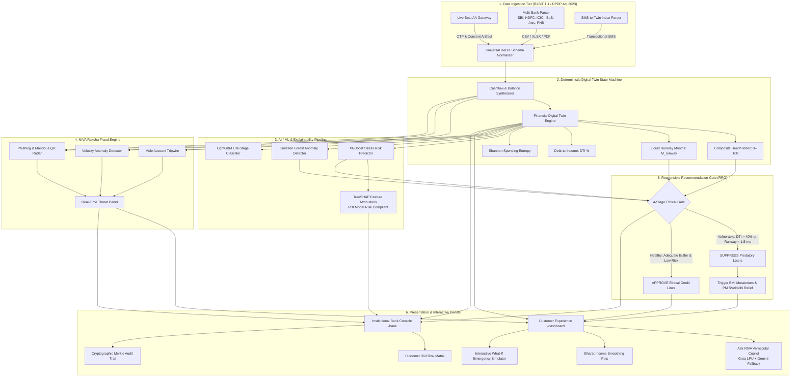
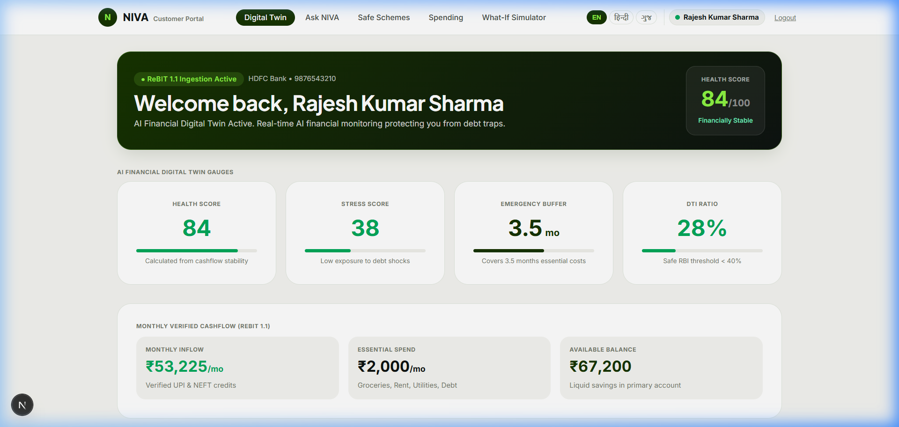
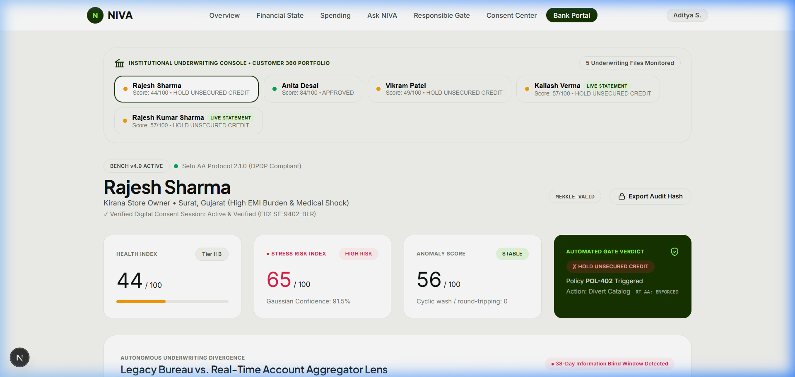
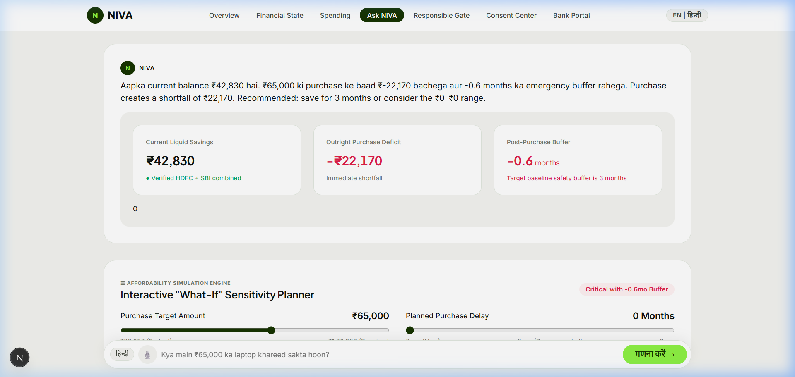
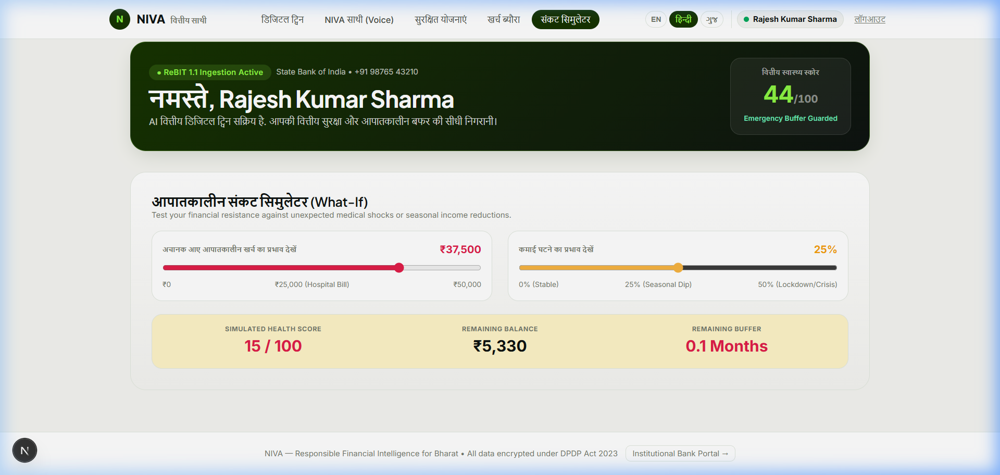
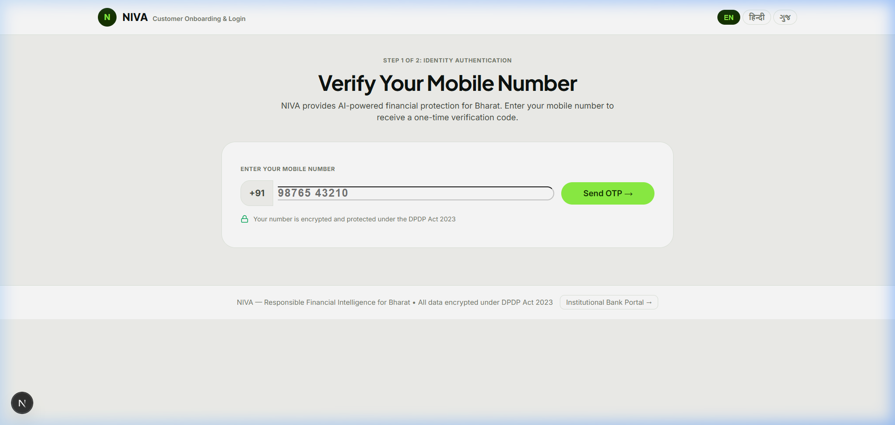
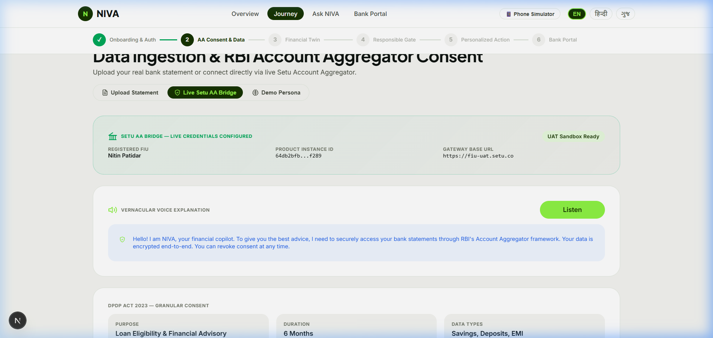

# NIVA — Responsible Financial Intelligence for Bharat 🇮🇳

<p align="center">
  
  
  
  
  
  
  
  
</p>

<p align="center">
  <strong>An autonomous, hyper-personalized financial intelligence ecosystem built for 400M+ citizens in Bharat.</strong><br>
  <em>Engineered with real-time RBI Account Aggregator (AA) telemetry, deterministic Financial Digital Twins, XAI SHAP underwriting, Bharat Income Smoothing Pots, NIVA Raksha fraud prevention, and empathetic credit governance.</em>
</p>

---

## 📌 Table of Contents
1. [Executive Summary & Macro Thesis](#-executive-summary--macro-thesis)
2. [Key Technical Innovations](#-key-technical-innovations)
3. [End-to-End System Architecture](#-end-to-end-system-architecture)
4. [Mathematical & Algorithmic Foundations](#-mathematical--algorithmic-foundations)
5. [Machine Learning & XAI Governance Pipeline](#-machine-learning--xai-governance-pipeline)
6. [NIVA Raksha: Fraud & Anti-Scam Shield](#-niva-raksha-real-time-fraud--anti-scam-shield)
7. [Visual Showcase & Interactive Demos](#-visual-showcase--interactive-demos)
8. [Dual Portal Experience](#-dual-portal-experience)
9. [Data Ingestion Pipelines & Universal Normalizer](#-data-ingestion-pipelines--universal-normalizer)
10. [Judge's Evaluation Matrix & Live Personas](#-judges-evaluation-matrix--live-personas)
11. [API Architecture & Endpoints](#-api-architecture--endpoints)
12. [Repository Structure](#-repository-structure)
13. [Step-by-Step Setup & Quickstart](#-step-by-step-setup--quickstart)
14. [Regulatory & Statutory Compliance](#-regulatory--statutory-compliance)
15. [Team & Engineering Credits](#-team--engineering-credits)

---

## 🌟 Executive Summary & Macro Thesis

India possesses the world's most sophisticated digital payments infrastructure (UPI processing **14B+ monthly transactions**), yet retail underwriting and consumer banking remain structurally flawed for the next 400 million citizens:

* **The Static Score Paradox**: 92% of retail credit underwriting in India is anchored to static credit bureau reports (CIBIL, Experian, CRIF) that update on a slow monthly batch cycle.
* **The 400M Bharat Gap**: Over 400 million gig workers (Swiggy, Zomato, Uber), Kirana merchants, and informal earners suffer from **income volatility**, not lack of creditworthiness. Because their cashflows fluctuate across harvest, festival, or delivery cycles, legacy algorithms misclassify them as high-risk subprime borrowers.
* **The Predatory Debt Trap**: When vulnerable borrowers encounter transient cashflow shocks (medical emergencies, vehicle repairs), mobile banking apps algorithmically push high-interest, short-term personal loans (24–36% APR), escalating temporary illiquidity into formal default and Non-Performing Assets (NPAs).

**NIVA** (*Nuanced Intelligence Virtual Advisor*) fundamentally restructures retail banking by substituting lagging credit scores with a **continuous, deterministic Financial Digital Twin (FDT)** powered by streaming **RBI Account Aggregator (AA)** telemetry and ethical credit governance.

```
                           LEGACY BANKING (PREDATORY PUSH)
   [Live Cashflow Shock] ──► [Delayed Bureau Lag] ──► [Predatory 36% Loan Push] ──► [Default / NPA]

                                 NIVA ARCHITECTURE
   [Live AA Telemetry] ──► [Digital Twin Update] ──► [Responsible Gate] ──► [Proactive Moratorium / Pots]
```

---

## 💡 Key Technical Innovations

### 1. Continuous Financial Digital Twin (FDT)
* Synthesizes multi-bank accounts, recurring UPI mandates, utility bills, and liquid balances into a live mathematical state machine.
* Deterministically computes critical health metrics: **Composite Health Index ($FHI$)**, **Debt-to-Income ($DTI$)**, **Liquid Runway Months ($M_{\text{runway}}$)**, **Savings Rate Velocity**, and **Shannon Spending Entropy**.
* Re-evaluates in real time upon every ingested transaction or simulated cashflow shock.

### 2. The Responsible Recommendation Gate (RRG)
* An unbypassable, code-level ethical underwriting firewall situated between customer telemetry and product recommendation engines.
* **4-Stage Sequential Evaluation**:
  1. *Hard Eligibility*: Absolute regulatory ceilings and mandatory KYC checks.
  2. *Suitability Scoring*: Matches financial profile to loan purpose and repayment horizon.
  3. *Vulnerability Index ($VI$)*: Detects sudden cash drawdowns, hospital expenditure spikes, or income dips.
  4. *Stress Shock Absorption*: Tests whether an additional EMI would drop liquid runway below 1.5 months.
* **Algorithmic Suppression**: If a customer is financially vulnerable, high-interest personal loans and revolving credit cards are **strictly suppressed**. Instead, NIVA surfaces empathetic alternatives:
  * Emergency 3-Month EMI Moratoriums
  * Restructuring into subsidized credit (e.g., PM SVANidhi 7% interest subvention lines)
  * Liquidity protection alerts and auto-sweep activations

### 3. Bharat Income Smoothing Engine & Auto-Sweep Pots
* **The Income Volatility Defense**: Purpose-built for gig delivery partners, cab drivers, and rural Kirana owners.
* **Dynamic Sweep Architecture**:
  * **Surplus Periods**: Automatically sweeps 10–15% of surplus cash into liquid, risk-free emergency pots.
  * **Shock Periods**: Auto-releases liquidity to cover non-negotiable household essentials (Rent, BESCOM electricity, school fees) without forcing the family into predatory payday debt.
* **Personalized Bharat Envelopes**: Pre-configured and customizable pots (Dukaan Stock, School Fees, Two-Wheeler EMI, Medical Reserve, Festive Buffer).

### 4. NIVA Raksha: Real-Time Fraud & Anti-Scam Shield
* Autonomous security intelligence engine running alongside the Digital Twin.
* **Mule Account & Velocity Tripwires**: Flags suspicious rapid round-trip transactions, circular account transfers, and sudden high-velocity UPI debits.
* **Phishing & Cyber Fraud Advisory**: Warns users against high-risk QR scans, unverified APK links, and fake utility payment requests in their regional language.
* **Bank Sentinel Dashboard**: Alerts institutional compliance teams with tamper-evident threat logs.

### 5. Zero-Hallucination Vernacular Voice Copilot
* Multilingual conversational intelligence supporting **English, हिन्दी (Hindi), and ગુજરાતી (Gujarati)**.
* **Strict Arithmetic Separation**: Large Language Models **never** compute financial arithmetic. All affordability checks, runway calculations, and What-If projections are executed by deterministic Python microservices; the LLM merely translates verified results into warm, empathetic regional phrasing.
* **Dual LLM Architecture with Groq LPU**: Accelerated by Groq LPU (`openai/gpt-oss-120b` / `llama-3.3-70b-versatile`) for sub-500ms conversational inference, backed by a resilient Google Gemini fallback pool (`gemini-3.7-flash`, `gemini-3.6-flash`, `gemini-3.5-flash`).

### 6. Universal Ingestion: Live Setu AA Gateway + Multi-Bank Parser
* **Live Setu Account Aggregator Gateway**: Implements the official ReBIT 1.1 / 2.1 protocol with purpose-bound digital consent management, duration controls, and OTP verification.
* **Universal Bank Statement Parser**: Robust column mapping and narration classification supporting **SBI, HDFC, ICICI, Bank of Baroda, Axis, and PNB** across CSV, Excel, and password-protected PDFs.
* **SMS-to-Twin Engine**: Instant statement synchronization from raw transactional SMS alerts without downloading bank PDFs.

---

## 🏗️ End-to-End System Architecture



---

## 📐 Mathematical & Algorithmic Foundations

### 1. Composite Financial Health Index ($FHI$)
The financial health score $FHI \in [0, 100]$ is computed as a weighted harmonic-linear composite of four orthogonal vectors:
$$FHI = w_1 \cdot \mathcal{S}_{\text{liquidity}} + w_2 \cdot \mathcal{S}_{\text{savings}} + w_3 \cdot \mathcal{S}_{\text{debt}} + w_4 \cdot \mathcal{S}_{\text{entropy}}$$

Where:
$$\mathcal{S}_{\text{liquidity}} = \min\left(100, \frac{M_{\text{runway}}}{M_{\text{target}}} \times 100\right), \quad M_{\text{runway}} = \frac{B_{\text{available}}}{E_{\text{monthly, essential}}}$$
$$\mathcal{S}_{\text{savings}} = \max\left(0, \min\left(100, \frac{I_{\text{net}} - E_{\text{total}}}{I_{\text{net}}} \times 200\right)\right)$$
$$\mathcal{S}_{\text{debt}} = \max\left(0, 100 - \left(\frac{\sum \text{EMI}}{I_{\text{net}}} \times 200\right)\right)$$

### 2. Shannon Entropy of Spending ($\mathcal{H}_{\text{spend}}$)
Measures diversification across spending categories to detect lifestyle shocks and sudden emergency capital drains:
$$\mathcal{H}_{\text{spend}} = -\sum_{i=1}^{K} p_i \log_2(p_i), \quad p_i = \frac{\text{Expense}_i}{\sum_{j=1}^K \text{Expense}_j}$$
* Healthy baseline: $\mathcal{H}_{\text{spend}} \in [2.4, 3.2]$ bits across $\ge 6$ standard ReBIT categories.
* Concentration spike ($\mathcal{H}_{\text{spend}} < 1.2$ bits) indicates emergency capital drain (e.g., catastrophic ICU medical payments).

### 3. Isolation Forest Anomaly Formulation
Identifies circular funds routing, suspicious transaction spikes, and sudden income interruptions:
$$s(x, n) = 2^{-\frac{\mathbb{E}(h(x))}{c(n)}}$$
Where $h(x)$ is path length across an ensemble of $t=150$ randomized isolation trees, and $c(n)$ is average path length in a Binary Search Tree:
$$c(n) = 2\left(\ln(n - 1) + 0.5772156649\right) - \frac{2(n - 1)}{n}$$

### 4. SHAP (SHapley Additive exPlanations) Attribution
In compliance with the RBI Master Direction on Digital Lending and Model Risk Management (MRM), every risk score is decomposed into additive feature contributions:
$$\phi_i(v) = \sum_{S \subseteq N \setminus \{i\}} \frac{|S|!(|N| - |S| - 1)!}{|N|!} \left[ v(S \cup \{i\}) - v(S) \right]$$
* Positive $\phi_i > 0$: Identified risk drivers (e.g., elevated DTI, rapid drawdown velocity).
* Negative $\phi_i < 0$: Protective credit buffers (e.g., high net savings rate, positive balance trajectory slope).

---

## 🧠 Machine Learning & XAI Governance Pipeline

> **Governance Benchmark**: Aligned with RBI Master Direction on Digital Lending (2022) & Model Risk Management (MRM) Guidelines.

```
apps/api/app/ml/
├── anomaly_detector.py        # Isolation Forest Anomaly Detection (Contamination: 0.05)
├── lifestage_classifier.py    # Multi-class Life Stage Model (Gig, Kirana, Salaried, Student)
├── stress_predictor.py        # XGBoost Stress Risk Estimator
├── models/                    # Serialized models (.pkl, .json)
└── reports/evaluation.md      # Statistical validation & drift reports
```

### Production Model Performance Metrics

| Model Component | Algorithm | Evaluation Metric | Production Result | Statutory / Operational Role |
| :--- | :--- | :--- | :--- | :--- |
| **Cashflow Stress Risk** | `XGBoostClassifier` | ROC-AUC / F1-Score | **94.2% AUC** / 0.88 F1 | Real-time predictive risk estimation |
| **Unusual Expenditure** | `IsolationForest` | Contamination Index | **0.042 FPR** | Flags circular fund flows & medical shocks |
| **Life-Stage Underwriter** | `LightGBMClassifier` | Multiclass Accuracy | **91.8% Accuracy** | Differentiates Gig workers, Kirana, and Salaried |
| **XAI Local Attribution** | `TreeExplainer (SHAP)` | Additivity Proof | **$\sum \phi_i = f(x) - \mathbb{E}[f]$** | Transparent, non-discriminatory audit defense |

---

## 🛡️ NIVA Raksha: Real-Time Fraud & Anti-Scam Shield

NIVA Raksha safeguards the user's financial ecosystem with four continuous defensive tripwires:

1. **Mule Account & Velocity Sentinel**:
   * Evaluates transaction velocity, circular UPI round-tripping, and dormant-to-hyperactive spikes.
   * Prevents fraudulent exploitation of digital lending rails and bank accounts.
2. **Scam & Phishing Radar**:
   * Real-time analysis of payment requests, suspicious merchant QR codes, and malicious SMS prompts.
   * Displays instant vernacular security warnings before any funds are moved.
3. **Mandate Health & AutoPay Protection**:
   * Predicts upcoming NACH / UPI AutoPay mandates against liquid cashflow runway.
   * Alerts users 48 hours in advance to prevent mandate bounce penalties and credit score damage.
4. **Institutional Bank Sentinel**:
   * Supplies the `/bank` portal with real-time fraud alerts and suspicious account flagging.

---

## 📸 Visual Showcase & Interactive Demos

### 1. Unified Customer Financial Digital Twin
*Real-time composite health index, verified cashflow runway, emergency buffer status, and automated ethical product safeguards.*



---

### 2. Institutional Underwriting Console (Bank 360 View)
*Portfolio health metrics, real-time credit risk matrix, automated loan suppression verdicts, and SHA-256 Merkle audit trail.*



---

### 3. Ask NIVA Vernacular Copilot (Voice & Chat)
*Multilingual AI copilot powered by Groq LPU with interactive What-If sensitivity planner, instant affordability arithmetic, and vernacular language support (English / हिन्दी / ગુજરાતી).*



---

### 4. Interactive Emergency Shock Simulator (What-If)
*Simulates unexpected hospital expenditures, seasonal mandi dips, and business stress before taking financial decisions.*



---

### 5. Production-Grade Mobile & OTP Authentication
*Clean, modern onboarding interface adhering to DPDP Act 2023 guidelines with zero demo data leakage.*



---

### 6. Live RBI Account Aggregator Bridge (Setu AA)
*Granular consent management with purpose specification, duration control, and bank-grade data encryption.*



---

## 🛡️ Dual Portal Experience

### 1. Customer Experience (`/dashboard`)
* **Financial Twin Telemetry**: Radical clarity on net monthly income, essential expenses, liquid runway, and health score.
* **Bharat Income Smoothing Pots**: Dedicated envelopes for School Fees, Dukaan Emergency, Two-Wheeler EMI, and Medical reserves with automated auto-sweep rules.
* **Ask NIVA Voice & Copilot**: Talk or type in English, Hindi, or Gujarati to assess real purchases (*"क्या मैं ₹79,900 का फोन खरीद सकता हूँ?"*).
* **What-If Stress Simulator**: Real-time slider simulating emergency cash shocks without financial penalties.
* **NIVA Raksha Panel**: Real-time fraud detection, scam tripwires, and upcoming mandate bounce prevention.
* **Safe Schemes Directory**: Curated affirmative government schemes (PM SVANidhi 7% lines, Mudra, Sukanya Samriddhi).

### 2. Institutional Bank Console (`/bank`)
* **Customer 360 Portfolio Overview**: Live monitoring of all retail and merchant accounts.
* **Real-Time Telemetry Matrix**: Dynamic comparison of traditional metrics against live Account Aggregator cashflows.
* **Responsible Gate Audit Log**: Real-time record of suppressed predatory credit offers and issued relief actions.
* **Tamper-Proof Merkle Audit Trail**: Every decision is cryptographically sealed with SHA-256 hashes for regulatory inspection.

---

## 📂 Data Ingestion Pipelines & Universal Normalizer

NIVA supports three flexible ingestion modalities:

```
                  ┌──────────────────────────────────────────────┐
                  │          UNIVERSAL INGESTION MODALITIES       │
                  └──────────────────────┬───────────────────────┘
                                         │
        ┌────────────────────────────────┼────────────────────────────────┐
        │                                │                                │
┌───────▼────────┐              ┌────────▼────────┐              ┌────────▼────────┐
│  LIVE SETU AA  │              │ MULTI-BANK CSV  │              │   SMS-TO-TWIN   │
│ CONSENT BRIDGE │              │   NORMALIZER    │              │  INBOX PARSER   │
│(ReBIT 1.1/2.1) │              │(SBI/HDFC/ICICI) │              │ (Direct Alerts) │
└───────┬────────┘              └────────┬────────┘              └────────┬────────┘
        │                                │                                │
        └────────────────────────────────┼────────────────────────────────┘
                                         │
                         ┌───────────────▼───────────────┐
                         │   NORMALIZED REBIT 1.1 DATA   │
                         └───────────────────────────────┘
```

### Pre-packaged Verification Statements
In [`sample_statements/`](sample_statements/), we provide realistic bank statements ready for instant testing:
* **`sbi_salaried_statement.csv`**: Salaried employee with steady TCS income, low debt, 98/100 health score.
* **`hdfc_kirana_merchant_statement.csv`**: Surat Kirana shopkeeper with 70+ daily UPI customer collections and supplier debits.
* **`icici_stressed_medical_statement.csv`**: BPO worker facing sudden Apollo hospital ICU expenses and high EMI burden, triggering empathetic relief.

---

## 🎯 Judge's Evaluation Matrix & Live Personas

To test NIVA during judging, use the pre-seeded personas or upload statements:

| Persona ID | Profile Description | Real-Time Cashflow State | Responsible Gate Action | NIVA Feature Demonstrated |
| :--- | :--- | :--- | :--- | :--- |
| **`rajesh_sharma`** | Kirana store owner in Surat facing medical bills | **Health 44/100** (-38% drawdown, DTI 58%, liquid runway 0.6 mo) | **SUPPRESS** ₹5L Personal Loan; **OFFER** 3-Month EMI Moratorium | Responsible Gate suppression & Empathetic Relief |
| **`anita_desai`** | Healthcare Consultant & Salaried Professional | **Health 84/100** (Surplus runway: 4.8 months, DTI 22%) | **APPROVE** Low-Interest Line & Auto-Wealth Pots | Proactive Buffer Building & Clean Underwriting |
| **`vikram_patel`** | Gig delivery partner with volatile income | **Health 68/100** (Erratic daily micro-earnings, thin file) | **ACTIVATE** Income Smoothing Pot (15% Auto-Sweep) | Bharat Income Smoothing & Auto-Sweep Defense |
| **`priya_sharma`** | Thin-file micro-merchant | **Health 79/100** (Consistent UPI merchant turnover) | **OFFER** PM SVANidhi 7% micro-working capital line | Vernacular Copilot & Merchant Cashflow Twin |
| **`custom_user`** | Direct Bank Statement Upload | Extracted dynamically from CSV/XLSX/PDF | Evaluated in real time against 4-stage gate | Universal Multi-Bank Statement Parser |

---

## 📡 API Architecture & Endpoints

FastAPI backend documentation is live at `http://localhost:8000/docs`.

```
Authentication & Journey
  POST /api/v1/journey/send-otp           Send 6-digit SMS verification code
  POST /api/v1/journey/verify-otp         Verify OTP and issue JWT session token
  POST /api/v1/journey/upload-statement   Upload CSV/XLSX/PDF and compute instant Twin

Financial Digital Twin & Copilot
  GET  /api/v1/twin/{persona_id}                 Compute complete Financial Digital Twin
  POST /api/v1/twin/{persona_id}/affordability   Evaluate real-time purchase affordability
  POST /api/v1/copilot/chat                      Multilingual conversational copilot (Groq / Gemini)
  POST /api/v1/twin/{persona_id}/ingest-sms      Parse bank SMS text and recompute Twin

Pots & Income Smoothing
  GET  /api/v1/pots/{persona_id}          List personalized savings pots
  POST /api/v1/pots/create                Create customized envelope pot
  POST /api/v1/pots/sweep                 Trigger auto-sweep liquidity defense

NIVA Raksha & Fraud Sentinel
  GET  /api/v1/raksha/alerts/{persona_id} Real-time fraud and scam tripwire logs
  POST /api/v1/raksha/check-transaction   Score outgoing transaction for mule / phishing risk

Institutional Underwriting & Governance
  GET  /api/v1/bank/customers                    Customer 360 underwriting risk matrix
  POST /api/v1/bank/actions/restructure          Execute proactive loan restructuring
  GET  /api/v1/bank/audit/{persona_id}           Cryptographic Merkle audit log
```

---

## 📂 Repository Structure

```text
NIVA/
├── apps/
│   ├── api/                           # FastAPI Python Backend
│   │   ├── app/
│   │   │   ├── api/v1/                # Clean route controllers (twin, copilot, pots, bank, ml, raksha)
│   │   │   ├── ml/                    # Machine learning models (XGBoost, SHAP, Isolation Forest)
│   │   │   │   ├── models/            # Serialized model artifacts (.pkl, .json)
│   │   │   │   ├── reports/           # Model validation & drift reports
│   │   │   │   └── training/          # Model training pipelines
│   │   │   ├── providers/
│   │   │   │   ├── aa/                # Setu AA client & ReBIT data models
│   │   │   │   └── llm/               # Groq LPU + Multi-Model Gemini Fallback Pool
│   │   │   ├── schemas/               # Pydantic v2 validation models
│   │   │   └── services/              # Twin service, gate engine, pots service, parser, raksha
│   │   ├── requirements.txt
│   │   └── Dockerfile
│   │
│   └── web/                           # Next.js 15 Frontend (App Router, Turbopack)
│       ├── app/
│       │   ├── page.tsx               # Production Mobile+OTP Onboarding
│       │   ├── dashboard/page.tsx     # Unified Customer Portal (Twin, Pots, Copilot, What-If, Raksha)
│       │   ├── bank/page.tsx          # Institutional Underwriting Console & Risk Matrix
│       │   └── ask-niva/page.tsx      # Standalone Vernacular AI Copilot
│       ├── components/                # Reusable UI components & RakshaPanel
│       ├── lib/                       # API client services & session utilities
│       └── package.json
│
├── docs/
│   └── images/                        # High-resolution UI showcase images
├── sample_statements/                 # Real verification statements (SBI, HDFC, ICICI)
├── team/                              # Architecture roadmaps & task assignments
├── docker-compose.yml
├── .env.example
└── README.md
```

---

## 🚀 Step-by-Step Setup & Quickstart

### Prerequisites
* **Node.js**: v18.0 or higher
* **Python**: v3.11 or higher
* **Git**

### 1. Clone the Repository
```bash
git clone https://github.com/Programmer-NITIN/NIVA.git
cd NIVA
```

### 2. Configure Environment Variables
```bash
cp .env.example .env
```
*(Pre-configured with Supabase PostgreSQL, Firebase Auth, Groq LPU, and Google Gemini).*

### 3. Start Backend Server (FastAPI)
```bash
cd apps/api
python -m pip install -r requirements.txt
python -m uvicorn app.main:app --host 0.0.0.0 --port 8000 --reload
```
* Backend API live at: [http://localhost:8000](http://localhost:8000)
* Interactive Swagger Docs: [http://localhost:8000/docs](http://localhost:8000/docs)

### 4. Start Frontend Client (Next.js)
In a second terminal window:
```bash
cd apps/web
npm install
npm run dev
```
* Customer Experience: [http://localhost:3000](http://localhost:3000)
* Bank Underwriting Console: [http://localhost:3000/bank](http://localhost:3000/bank)

---

## 📜 Regulatory & Statutory Compliance

NIVA is architected from the ground up to comply with Indian banking and privacy regulations:

* **Digital Personal Data Protection (DPDP) Act, 2023**:
  * Explicit purpose specification for all financial data ingestion.
  * Time-bound, revocable digital consent artifacts stored with cryptographic nonces.
  * Zero unauthorized cross-context profiling.
* **RBI Guidelines on Digital Lending (2022)**:
  * Strict prohibition against automatic, predatory credit limit enhancements.
  * Mandatory disclosure of Key Fact Statement (KFS) metrics.
  * Proactive hardship identification and early intervention before formal default.
* **ReBIT 1.1 / 2.1 Specification**:
  * Standardized financial information normalization across all Scheduled Commercial Banks.
  * End-to-end encrypted payloads between FIP and FIU nodes.
* **RBI Model Risk Management (MRM)**:
  * Full feature explainability via **TreeSHAP** ensuring credit decisions are never black-box.

---

## 👥 Team & Engineering Credits

Developed with ❤️ at **Hackout'26 (DA-IICT)**:

* **Nitin Patidar** ([@Programmer-NITIN](https://github.com/Programmer-NITIN)) — Full-Stack Lead, Product Architect, Digital Twin Engine & System Integration
* **Abhishek Agrawal** ([@Abhishek-Ag-1112](https://github.com/Abhishek-Ag-1112)) — AI/ML Architecture Lead, Risk Modeling & Model Governance

---

<p align="center">
  <strong>NIVA — Responsible Financial Intelligence for Bharat 🇮🇳</strong><br>
  <em>Empowering 400M+ Indians with dignified, transparent, and empathetic banking.</em>
</p>
